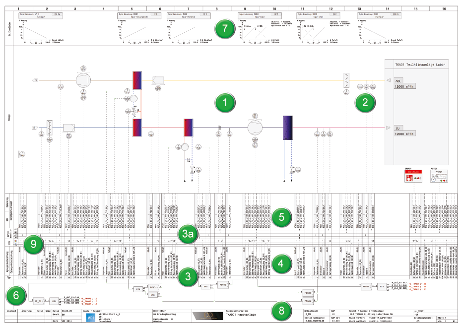
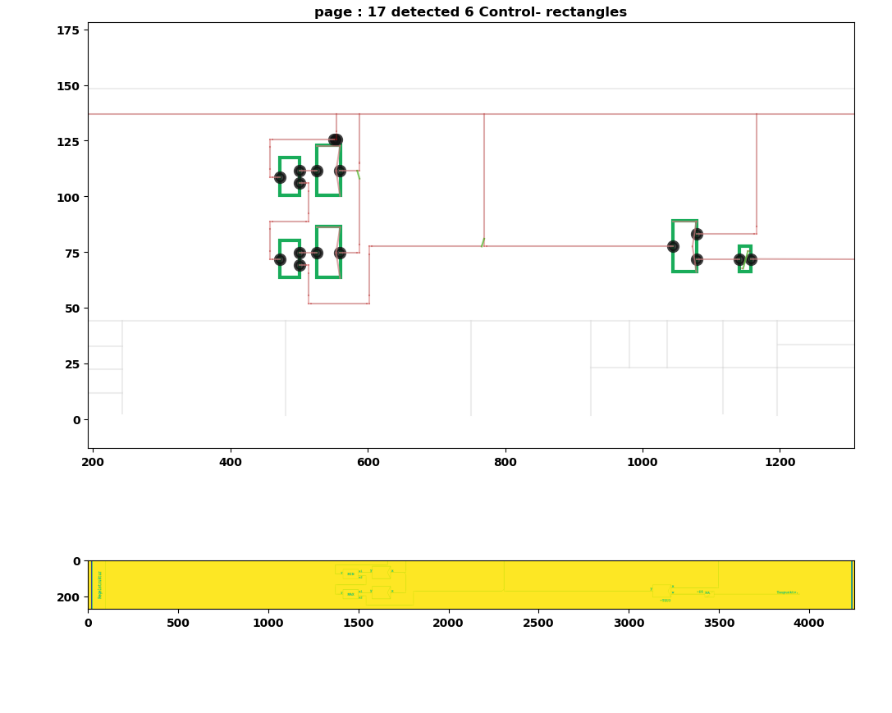
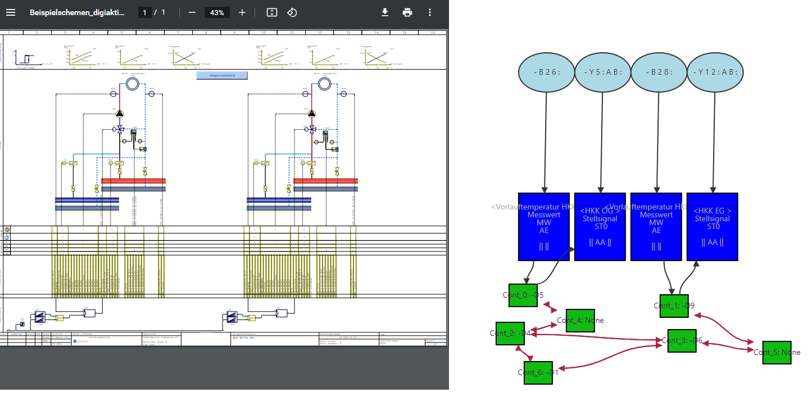

# BAschema2model
convert Building Automation Control System diagrams to machine readable format

BAschema2model is a program to convert Building Automation Control Structure diagrams 
in VDI3814 format to machine readable format, and create interactive visualization from the processed data.
The input is a pdf file exported with a VDI 3814 compliant BACS tool. Tested with WSCAD-BA diagrams.

The format of the BACS schema is defined in the VDI 3814 norm:

This program is trying to identify the datapoints, that are inputs and outputs of the BACS function structure (section 6), 
parse the function structure with its connections, extract the text labels of the datapoints.

BACS function structure diagram parsing: rectangles and terminal points are detected from the pixelgraphic representation.

The extracted data is visualized in a JavaScript diagram. This can be automatically generated by the code:

The extracted information can also be exported in text format (for example json or xml)

## Acknowledgements
The research leading to this repository was financed by the Austrian Research Promotion Agency (ffg) over the project [Digiaktiv](https://projekte.ffg.at/projekt/3793874)